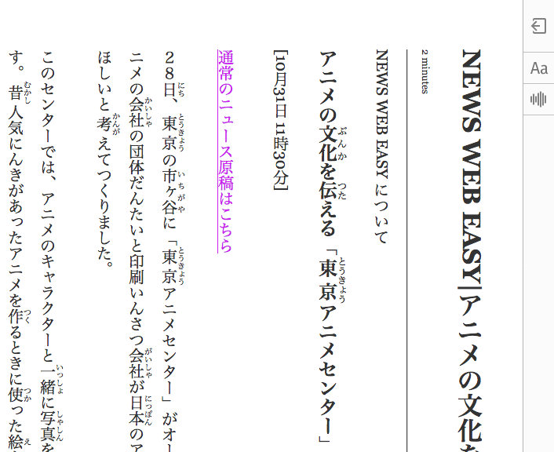

# rtl-reader-view

Activate Firefox's [reader view](https://support.mozilla.org/en-US/kb/firefox-reader-view-clutter-free-web-pages) and then use this to convert it to top-down, right-to-left.

This is mainly a proof of concept. Not all vertical text CSS rules are supported by Firefox yet: see the [draft specification](https://drafts.csswg.org/css-writing-modes-4/#text-combine-upright) and [Styling vertical Chinese, Japanese, Korean and Mongolian text](https://www.w3.org/International/articles/vertical-text/) for details.

## Usage

See the [project page](https://gyng.github.io/rtl-reader-view).

## Notes

### Supported features

* Reader view controls
* Toggle button in reader view
* Scroll direction (wheel, home keys)
* Defaults to ja fonts, overridden by `lang=zh`
* Vertical punctuation
* `text-emphasis` on `<emp>` tags [圏点](https://ja.wikipedia.org/wiki/%E5%9C%8F%E7%82%B9), [着重号](https://zh.wikipedia.org/wiki/%E7%9D%80%E9%87%8D%E5%8F%B7)

### Unsupported

* Upright [縦中横](https://ja.wikipedia.org/wiki/%E7%B8%A6%E4%B8%AD%E6%A8%AA) (tate chu yoko) for digits: `text-combine-upright: digits 4;`
* Upright list markers
* Underlines on the left: `text-underline-position: left;`
* Hanging punctuation: `hanging-punctuation: end;`

### Other notes

* Times override for Georgia old-style numerals using `@font-face` and `unicode-range`
* Full-width commas in Chinese text are still curly `，` instead of being ideographic commas `、`

## Building `index.html`

    make page
    watch -n 0.5 make page
